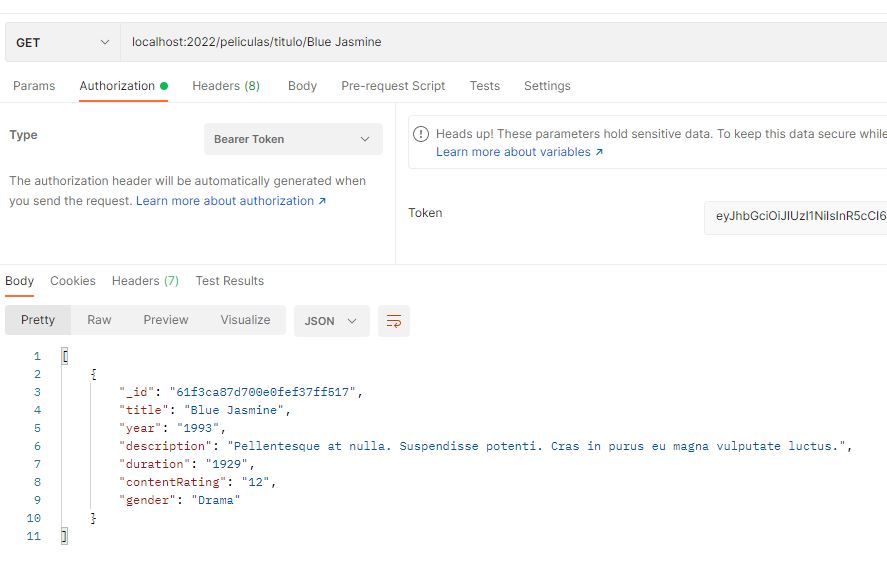
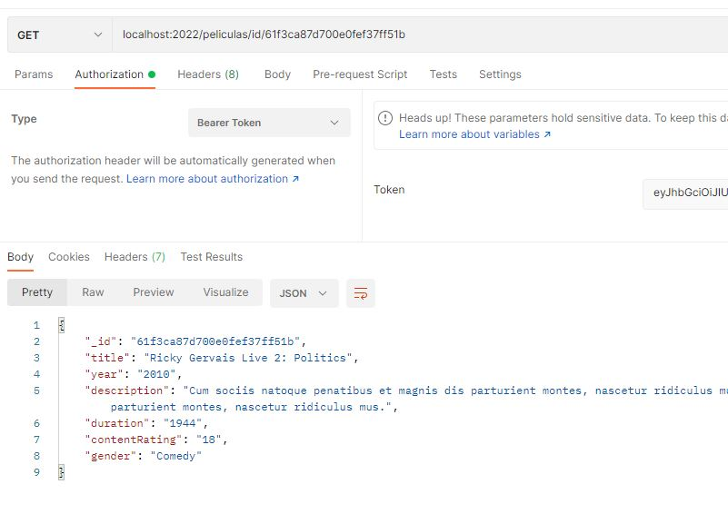

# Proyecto4_Backend_Movies

Este proyecto trata de API para gestionar Usuarios, Peliculas y los Pedidos de estos. Utilizaremos una base de datos en MongoDB para trabajar con los datos de todos los mencionados.

## Comenzando 🚀

Estas instrucciones te permitirán obtener una copia del proyecto en funcionamiento en tu máquina local para propósitos de desarrollo y pruebas.


### Instalación 🔧

* Clona el repositorio a tu maquina local
```
git clone https://github.com/Rafael3994/Proyecto4_Backend_Movies.git
```
* Crea un Cluster y una Base de datos en MongoDB, para ello deberas registrarte. En models/schemas/MOCK_DATA.json encontraras los datos de la tabla peliculas.
* Instalamos node.js en el ordenador, con ello tambien abremos instalado npm.
* Abrimos el repositiorio clonado con un IDE y ejecutamos el comando de npm.
```
npm install
```
* Copia en fichero .env-sample y dejalo con el nombre .env.<br>
Veras que hay tres variables a las que asignar un valor:
```
## Link de mongoDB (recuerda cambiar <password> por tu contraseña de usuario y      ## myFirstDatabase por el nombre de tu base de datos).
MONGO_URI=

## El puerto donde se ejecutara la aplicacion.
PORT=

## Palabra con la que se cifrara el Token
JWT_SECRET=
```

* Finalmente para iniciar el proyecto ejecuta el comando
```
npm start
```


## Ejecutando las pruebas ⚙️

Estas son las funcionalidades de esta API:

Usuarios:

* Registra usuarios (POST: /users/register)<br>

<br> Si ponemos role: "admin" en el body crearemos un usuario con el role de admin.

* Login de usuario (POST: /users/login)<br>


Los siguentes endpoint requieren de JWT, cuando te logueas con un usuario se creara este.

* Mostrar usuario por ID (GET: users/:id) <br>


* Eliminar usuario por ID (DELETE: users/:id) <br>


Peliculas:

* Mostrar todas las peliculas (GET: /peliculas) <br>


* Mostrar peliculas por titulo (GET: /peliculas/titulo/:titulo) <br>


* Mostrar peliculas por ID (GET: /peliculas/id/:id) <br>


Pedidos:

* Crear pedidos (GET: /pedidos) <br>


<br><br>
## Construido con 🛠️

* [JavaScript](https://www.javascript.com/) - Lenguaje de programacion
* [Node.js](https://nodejs.org/es/) - Entorno de ejecucion
* [Express](https://expressjs.com/es/) - Framework de node para Backend
* [MongoDB](https://www.mongodb.com/) - Base de datos

## Autores ✒️

* **Rafael Garcia Perez** - [rafael3994](https://github.com/Rafael3994)

## Licencia 📄

Este proyecto está bajo la Licencia.
